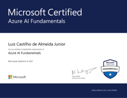

# Currículo online de Luiz Castilho de Almeida Junior

Olá!

Neste repositório você encontrará informações sobre meu currículo digital.

<!---->

Sou profissional formado em **Engenharia Química** e há 6 anos atuo no setor de Etanol e Açúcar, atualmente como Coordenador de Produção da Usina Rio Pardo localizada em Cerqueira-César/SP.

Mas nos últimos meses descobri o universo da tecnologia e tenho dedicado grande parte do meu tempo investindo em aprofundar conhecimento nessa área.

Iniciei meu aprendizado com as tecnologias do **Front-End** e também a linguagem **Python**.

Ao longo dos últimos meses já conclui diversos cursos livres e obtive a certificação **Azure AI Fundamentals**.

Convido você a visitar meu currículo digital clicando [aqui](https://luizalmeidajr.github.io/curriculo/) ou entrar em contato comigo.

 [LinkedIn](https://www.linkedin.com/in/luiz-almeida-jr-643789224/)
 [GitHub](https://github.com/LuizAlmeidaJr)
