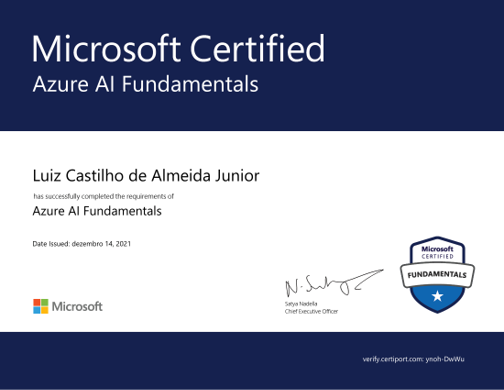

# Currículo online de Luiz Castilho de Almeida Junior

Hello World!

Neste repositório você encontrará informações sobre meu currículo digital.

<!---->

Sou profissional formado em **Engenharia Química** e há 7 anos atuo no setor de Etanol e Açúcar, atualmente como Coordenador de Produção da Usina Rio Pardo localizada em Cerqueira-César/SP.

Nesse tempo consegui desenvolver minhas habilidades de liderança, trabalho em equipe, gestão de tempo e gestão de recursos.

Mas há 2 anos descobri o universo da tecnologia e tenho dedicado grande parte do meu tempo investindo em aprofundar meus conhecimentos nessa área.

Em dezembro de 2023, iniciei meus estudos na **Rocketseat**. 

Já desenvolvi projetos utilizando as tecnologias do **Front-End** e também a linguagem **Python**.

Ao longo dos últimos anos já conclui diversos cursos livres e obtive a certificação **Azure AI Fundamentals**.

Convido você a visitar meu currículo digital clicando [aqui](https://luizalmeidajr.github.io/curriculo/) ou entrar em contato comigo.

 [LinkedIn](https://www.linkedin.com/in/luiz-almeida-jr-643789224/)
 [GitHub](https://github.com/LuizAlmeidaJr)
